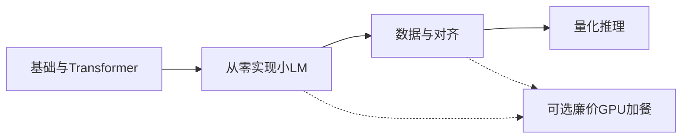

# 大模型全链路学习报告

**适用对象：** 希望系统掌握大模型实现链路，但本机没有 NVIDIA 独显（CPU / 核显）的学习者  
**硬件前提：** Windows，CPU 训练与推理；内存建议 ≥16GB（32GB 更稳）；磁盘预留 50–100GB  
**学习强度：** 每周约 10–15 小时，主路径 12 周  
**整理日期：** 2026-09-18

---

## 1. 结论先看

没有独显，**不能**按斯坦福课表把 CS336 五份作业原样跑完，但**可以**在本机把「从零实现」这条链路学深：

**分词 → Transformer → 小模型预训练 → SFT → 偏好对齐 → 量化推理**

原则只有一条：**本机写代码、跑单元测试和小规模训练；大卡训练只当可选加餐。**

清华唐杰《高级机器学习》偏理论广度（表示学习、GNN、AutoML、RL、BERT），**不是** CS336 那种「自己造一条 LLM 生产线」。小红书一类帖子通常是「理论用唐杰、工程用 CS336」。你的主线应是：

- **深度主课：** Stanford CS336 讲座 + Assignment 1（缩小规模）
- **中文动手：** Happy-LLM + MiniMind
- **笔记本友好实现：** Sebastian Raschka《Build a Large Language Model From Scratch》
- **手感课：** Andrej Karpathy Zero to Hero / nanoGPT
- **唐杰课、李宏毅课：** 选读，补概念，不当实现主线



学完后应能做到：

1. 不依赖 `nn.Transformer`，自己写出 BPE、Attention、GPT/LLaMA 小模型、AdamW、训练循环。
2. 在 CPU 上训出一个能续写短故事的小语言模型，并看懂 loss / perplexity。
3. 在已有小权重上完成 SFT 和 toy DPO，能解释和手写 DPO loss。
4. 用 llama.cpp / Ollama 做量化推理，说清 KV cache、采样、量化各自解决什么问题。
5. 能读懂工业级链路（数据清洗、Scaling Law、分布式、RLHF），知道哪些必须 GPU、哪些可以缩小复现。

---

## 2. 本机能做什么、不能做什么

### 2.1 能本机做

| 环节 | 做法 | 预期耗时（粗算） |
|---|---|---|
| 字节级 BPE | TinyStories valid 子集或更小 debug 集 | 数十分钟到数小时 |
| 手写 Attention / GPT | 单元测试 + 小 batch 前向 | 秒到分钟 |
| Shakespeare 字符级预训练 | nanoGPT 官方 CPU 配置 | 数小时 |
| TinyStories 缩小版预训练 | 4–6 层、`d_model` 256–384、ctx 128–256 | 数小时到一天（视 CPU） |
| 数据过滤 / 去重 | 小 crawl 样本或开源小语料 | CPU 友好 |
| SFT / toy DPO | 加载 MiniMind / SmolLM2-135M / Happy-LLM-215M 权重 | 小时级，数据要很小 |
| 量化推理 | llama.cpp / Ollama：0.5B–1.5B Q4 | 实时到可接受延迟 |

CS336 Assignment 1 手out 写明：staff 实现可在 Apple CPU 上约 **30 分钟**训出能讲儿童故事的小 LM（Metal GPU 约 5 分钟）。Karpathy nanochat 提供 `runs/runcpu.sh`：Mac 约 30 分钟训 6 层模型（官方注明这是演示，不是刷分）。Windows CPU 会更慢，但仍是正确学习路径。

### 2.2 不要本机硬扛

- FlashAttention / Triton kernel、多机并行（CS336 A2）
- OpenWebText 完整预训练、CS336 A1 leaderboard
- 7B 全参训练、Happy-LLM 215M 从零训
- CS336 A5 原规模推理 RL
- vLLM 吞吐压测、8×H100 级 nanochat speedrun

### 2.3 环境建议（Windows + CPU）

```text
Python 3.11+
uv（推荐）或 venv
PyTorch CPU 轮子
pytest
llama.cpp（AVX2）或 Ollama
可选：Git LFS（拉模型权重时）
```

内存 ≥16GB；32GB 更适合同时开 IDE、数据预处理和 0.5B–1.5B 推理。磁盘预留 50–100GB。

推理模型优先顺序（由易到难）：

1. MiniMind 发布权重（几十 MB 级，CPU 几乎无压力）
2. SmolLM2-135M
3. Qwen2.5-0.5B Q4
4. Qwen2.5-1.5B Q4（16GB 内存可试，会慢）

---

## 3. 课程对比

### 3.1 你点名的两门课

**Stanford CS336: Language Modeling from Scratch**

- 站点：[https://cs336.stanford.edu/](https://cs336.stanford.edu/)
- 2025 存档：[https://cs336.stanford.edu/spring2025/](https://cs336.stanford.edu/spring2025/)
- 讲座录像：[YouTube 播放列表](https://www.youtube.com/watch?v=JuoVZkPBiKk&list=PLoROMvodv4rMqXOcazWaTUHhq-yembLCV)
- 定位：像操作系统课「从零写 OS」一样，从零写语言模型。覆盖数据收集清洗、Tokenizer、Transformer、训练、评测、对齐。
- 作业：
  - [A1 Basics](https://github.com/stanford-cs336/assignment1-basics)：BPE、模型、优化器、训练 TinyStories
  - [A2 Systems](https://github.com/stanford-cs336/assignment2-systems)：profiling、Triton FlashAttention、分布式
  - [A3 Scaling](https://github.com/stanford-cs336/assignment3-scaling)：组件消融、Scaling Law
  - [A4 Data](https://github.com/stanford-cs336/assignment4-data)：Common Crawl → 可用预训练数据
  - [A5 Alignment](https://github.com/stanford-cs336/assignment5-alignment)：SFT + 推理 RL，可选 DPO
- 自学 GPU 建议：先在 CPU 上调通正确性，再上云做训练/benchmark。2026 课表提到 Modal 每月约 $30 免费额度。
- **对本机：** A1 缩小规模是主作业；A2 只听讲座；A4 做小样本；A5 做玩具实现。

**清华唐杰《高级机器学习》**

- 知乎笔记专栏：[清华大学《高级机器学习》课程笔记](https://www.zhihu.com/column/c_1425162382481580032)
- 内容：表示学习、网络表示、AutoML、对抗学习、在线学习/老虎机、强化学习、BERT、认知推理、GNN 等。
- 定位：研究生级**广义机器学习**，不是「LLM 全链路工程课」。
- 唐杰另有 GLM / 悟道 / ChatGPT 公开演讲（清华荷声讲坛、高等教育论坛、B 站），适合补「大模型能力演化、Scaling、领域模型」观点。
- **对本机：** 选读表示学习、BERT、强化学习三块；不要把它当 CS336 替代。

### 3.2 主线资源（必须跟，能写代码）

| 资源 | 覆盖 | 本机可行性 | 怎么用 |
|---|---|---|---|
| CS336 讲座 + A1 | Tokenizer、架构、优化器、训练；讲座还覆盖数据/对齐/推理 | A1 缩小规模 + pytest 可跑 | 深度主课，先自己写再对照 |
| [Happy-LLM](https://github.com/datawhalechina/happy-llm) | NLP → Transformer → 手写 LLaMA2 → Pretrain/SFT/LoRA → RAG/Agent → GRPO | 第 1–5 章可本机实现；215M 用他们提供的权重 | 中文主教材 |
| [Raschka LLMs-from-scratch](https://github.com/rasbt/LLMs-from-scratch) | 文本、Attention、GPT、预训练、分类微调、指令微调、LoRA、KV cache | 正文按笔记本设计，Windows 有 CI | 英文逐步实现 |
| [MiniMind](https://github.com/jingyaogong/minimind) | Tokenizer → 预训练 → SFT → LoRA → DPO，可导出 llama.cpp | 读代码 + 发布权重推理必做；从零训约 26M–64M 建议过夜 CPU 或租 3090 约 2 小时 | 迷你全链路产品 |
| [Karpathy Zero to Hero](https://karpathy.ai/zero-to-hero.html) + [nanoGPT](https://github.com/karpathy/nanoGPT) | 手写 GPT、字符级训练 | Shakespeare CPU 配置官方支持 | 第 1–2 周建立手感 |

Happy-LLM 215M 权重：

- Base：[https://www.modelscope.cn/models/kmno4zx/happy-llm-215M-base](https://www.modelscope.cn/models/kmno4zx/happy-llm-215M-base)
- SFT：[https://www.modelscope.cn/models/kmno4zx/happy-llm-215M-sft](https://www.modelscope.cn/models/kmno4zx/happy-llm-215M-sft)
- 在线阅读：[https://datawhalechina.github.io/happy-llm/](https://datawhalechina.github.io/happy-llm/)

### 3.3 对齐与小模型实战（后半段）

| 资源 | 用途 | 注意 |
|---|---|---|
| [Hugging Face smol-course](https://github.com/huggingface/smol-course) | SFT、评测、DPO；宣称多数本机可跑 | 用 SmolLM2-135M / MiniMind，不要一上来 SmolLM3-3B |
| CS336 A5 | 理解 SFT、推理 RL、DPO 作业结构 | 本机只复现算法骨架，数据缩小 |
| [reasoning-from-scratch](https://github.com/rasbt/reasoning-from-scratch) | 推理模型概念 | 选读 |

### 3.4 理论课（看讲座，少写大规模训练）

| 课程 | 链接 | 用途 |
|---|---|---|
| 李宏毅《生成式人工智慧與機器學習導論 2025》 | [YouTube 播放列表](https://www.youtube.com/watch?v=VuQUF1VVX40&list=PLJV_el3uVTsMMGi5kbnKP5DrDHZpTX0jT) | 中文建立 LLM 解剖图：Token、训练阶段、Context Engineering、Agent |
| CMU 11-711 Advanced NLP | [2026 站点](https://cmu-l3.github.io/anlp-spring2026/) | 预训练 / 微调 / 解码 / RLHF / 量化；作业 1 是 Mini-LLaMA，可作 CS336 A1 对照 |
| Stanford CS224N | 每年公开 | 深度学习 NLP 基础，作业偏 Colab |
| Stanford CS324 / Princeton COS 597G | 公开课页 | 综述与论文，不当动手主线 |

CMU 11-711 代码：[https://github.com/cmu-l3/anlp-spring2026-code](https://github.com/cmu-l3/anlp-spring2026-code)

### 3.5 系统课（只听不练，除非以后有 GPU）

| 资源 | 链接 |
|---|---|
| CS336 A2 | [assignment2-systems](https://github.com/stanford-cs336/assignment2-systems) |
| CMU 11-868 LLM Systems | [https://llmsystem.github.io/llmsystem2025spring/](https://llmsystem.github.io/llmsystem2025spring/) |
| CMU 15-779 ML Systems（LLM Edition） | [CS DIY 介绍](https://csdiy.wiki/%E6%B7%B1%E5%BA%A6%E7%94%9F%E6%88%90%E6%A8%A1%E5%9E%8B/%E5%A4%A7%E8%AF%AD%E8%A8%80%E6%A8%A1%E5%9E%8B/CMU15-779/) |
| Hugging Face Ultra-Scale Playbook | [https://huggingface.co/spaces/nanotron/ultrascale-playbook](https://huggingface.co/spaces/nanotron/ultrascale-playbook) |

更全课表索引：[CS DIY 深度生成模型学习路线](https://csdiy.wiki/%E6%B7%B1%E5%BA%A6%E7%94%9F%E6%88%90%E6%A8%A1%E5%9E%8B/roadmap/)

### 3.6 明确不作为主线的课

- LangChain / 调 API 应用课、多数吴恩达生成式应用专项：学应用可以，**不能替代**全链路实现。
- Fast.ai、Hugging Face NLP Course：入门有用，深度和「从零造模型」不够。
- nanochat 完整 GPT-2 级 speedrun：需要 8×H100 量级，只读代码和 `runcpu.sh`。

---

## 4. 十二条链路对照：课怎么覆盖、你怎么做

工业界一条 LLM 链路大致如下。右列是 CPU 学习者的落地方式。

| 链路环节 | 课 / 资料 | 本机动作 |
|---|---|---|
| 1. 文本与 Unicode | CS336 A1 §2 | 写 `ord`/`utf-8` 实验，理解为何用 byte-level BPE |
| 2. BPE Tokenizer | CS336 A1、Karpathy tokenizer 视频、Happy-LLM 第 5 章 | 自己实现；先 valid 子集 |
| 3. Attention / Transformer | Raschka 第 3–4 章、Happy-LLM 第 2 章、CS336 讲座 3 | 禁止直接调用 `nn.MultiheadAttention` 交差 |
| 4. 预训练目标与训练循环 | CS336 A1、nanoGPT、Raschka 第 5 章 | 交叉熵、AdamW、ckpt、perplexity |
| 5. 数据清洗与去重 | CS336 A4、讲座 13–14 | 小样本语言过滤 + MinHash |
| 6. Scaling Law | CS336 A3、Kaplan / Chinchilla | 读论文 + 算参数量和粗 FLOPs，不调他们的训练 API |
| 7. 系统与内核 | CS336 A2、CMU 11-868 | **只听** |
| 8. 评测 | CS336 讲座 12、CMU 11-711 evaluation | 本机算 PPL 和人工看生成 |
| 9. SFT | Happy-LLM 第 6 章、smol-course Unit 1、CS336 讲座 15 | 加载小权重，小指令集 |
| 10. DPO / RLHF | CS336 A5、smol-course Unit 3、唐杰 RL 讲 | 手写 DPO loss，几百条偏好对 |
| 11. 推理、采样、KV cache | CS336 讲座 10、Raschka ch04 bonus | 实现 temperature / top-p / KV cache |
| 12. 量化与本地 serving | llama.cpp、CMU 11-711 量化课 | GGUF / Ollama 跑自己的或开源小模型 |

---

## 5. 十二周学习计划

每周按 10–15 小时估。若只有 6–8 小时，把第 3–6 周拉成 6 周，总时长约 16 周；不要删 A1。

### 第 0 周：环境与推理手感

**目标：** 工具链能跑，先体验「小模型在本机说话」。

**做：**

1. 安装 Python 3.11+、Git、`uv`。
2. 安装 PyTorch CPU。
3. 安装 Ollama 或编译 llama.cpp，跑通一个小模型。
4. 克隆四个仓库（先不要改）：

```bash
git clone --depth 1 https://github.com/stanford-cs336/assignment1-basics.git
git clone --depth 1 https://github.com/rasbt/LLMs-from-scratch.git
git clone --depth 1 https://github.com/datawhalechina/happy-llm.git
git clone --depth 1 https://github.com/jingyaogong/minimind.git
```

Ollama 示例（若已安装）：

```bash
ollama run qwen2.5:0.5b
```

**验收：** 本机能对话；四个仓库能打开 README。

---

### 第 1–2 周：手感 + Transformer

**看：**

- Karpathy: [Let’s build GPT](https://www.youtube.com/watch?v=kCc8FmEb1nY)
- Karpathy: [Let’s build the GPT Tokenizer](https://www.youtube.com/watch?v=zduSFxRajkE)
- Happy-LLM 第 1–2 章，或 Raschka 第 2–4 章（二选一作精读，另一份略读）

**做：** nanoGPT 官方 CPU 训练（Windows 在仓库根目录）：

```bash
pip install torch numpy transformers datasets tiktoken tqdm
python data/shakespeare_char/prepare.py
python train.py config/train_shakespeare_char.py --device=cpu --compile=False --eval_iters=20 --log_interval=1 --block_size=64 --batch_size=12 --n_layer=4 --n_head=4 --n_embd=128 --max_iters=2000 --lr_decay_iters=2000 --dropout=0.0
python sample.py --out_dir=out-shakespeare-char --device=cpu
```

自己写出：scaled dot-product attention、一层 Transformer block（可放在后续 A1 仓库里预热）。

**验收：** loss 明显下降；能采样出「像莎士比亚但不一定通顺」的文本。

---

### 第 3–6 周：CS336 A1（本方案最重要）

**看：** CS336 讲座 1–4、10；A1 PDF：

[cs336_assignment1_basics.pdf](https://github.com/stanford-cs336/assignment1-basics/blob/main/cs336_assignment1_basics.pdf)

**实现顺序（不要用 `torch.nn.functional` 里现成 Transformer 定义交差，handout 有白名单）：**

1. 字节级 BPE：词表初始化、预分词、merge、特殊 token
2. Transformer LM
3. 交叉熵 + AdamW
4. 训练循环、序列化、生成、perplexity

先跑测试：

```bash
cd assignment1-basics
uv run pytest
```

数据：优先 TinyStories **validation**（约 2 万文档）做 tokenizer 和过拟合实验，不要一上来 200 万文档的 train。下载命令见 A1 README。

**本机训练设定（不要刷 OpenWebText 榜）：**

- 层数 4–6
- `d_model` 256–384
- 上下文 128–256
- batch 按内存往下调
- 目标：能生成通顺短故事，不追 leaderboard

对照时可以看 Happy-LLM 第 5 章、MiniMind 源码，但**先自己写再对照**。

**验收：**

- `uv run pytest` 大部分通过
- CPU 训出的模型能续写简单儿童故事
- 能口头解释：BPE merge 在优化什么、Pre-LN 和 Post-LN 差别、AdamW 相对 SGD 解决什么

---

### 第 7 周：数据与规模直觉

**看：** CS336 讲座 13–14；浏览 [A4](https://github.com/stanford-cs336/assignment4-data)；Kaplan 2019、Hoffmann 2022（Chinchilla）摘要。

**做（小样本即可）：**

- 语言识别 / 简单质量规则
- MinHash 或精确 hash 去重
- 文档长度、重复率统计
- 估算：若把本机小模型放大 10× 参数、数据 10×，算力大约要多少（粗算即可）

不必调用 CS336 A3 的训练集群 API。

**验收：** 一份短笔记：原始文本 → 过滤 → 去重 → token 数；列出你丢掉了哪些垃圾。

---

### 第 8–10 周：SFT 与对齐

**看：**

- Happy-LLM 第 6 章
- smol-course Instruction Tuning + Preference Alignment
- CS336 讲座 15–17 与 A5 补充 PDF
- 选看：李宏毅「大型语言模型的学习历程」；唐杰课强化学习 / BERT

**做：**

1. **不要从零训 215M。** 加载 MiniMind 或 Happy-LLM-215M 或 SmolLM2-135M。
2. 准备很小的指令集（几百到一两千条即可）。
3. 跑 SFT，对比「基座续写」vs「会跟着指令走」。
4. 手写 DPO loss，用几百条偏好对做 toy 训练。
5. 读懂 PPO / GRPO 在讲什么；本机不跑原规模 RL。

**验收：** 同一小模型 SFT 前后行为可复述；DPO 后偏好指标或人工对比有变化（哪怕很小）。

---

### 第 11–12 周：推理与收口项目

**看：** CS336 推理讲座；Raschka KV cache bonus；CMU 11-711 量化 slides。

**做：**

- 实现 temperature、top-k / top-p
- 实现 KV cache，对比有无 cache 的速度（CPU 上差异也看得出）
- 把 MiniMind 或自己的小 GPT 接到 llama.cpp / Ollama
- 不要做 vLLM、Triton

**收口项目（建议就放在本仓库）：**

1. 自己的 BPE
2. 自己的 Transformer
3. CPU 预训练日志 + 生成样例
4. SFT / DPO 前后对比
5. llama.cpp 对话截图或脚本
6. 一页笔记：参数量、粗 FLOPs、本机耗时、若有 GPU 会怎么放大

---

## 6. 可选：只租一次卡

不是必须。若只花一次钱，优先：

**用 MiniMind 官方预训练脚本在单卡 3090 上完整跑通（官方口径约 2 小时），把 checkpoint 拷回本机继续 SFT / 推理。**

不要把钱花在「跑通别人 notebook，但自己没写过模型」。

免费/低成本算力备选：

- Kaggle Notebook：每周约 30 小时 GPU
- Google Colab 免费 T4（不稳定）
- 国内消费级 3090 租用（约几元/小时）
- CS336 课表提到的 Modal 每月免费额度（需注册，按官网为准）

---

## 7. 本机命令速查

### 7.1 nanoGPT（CPU）

见第 1–2 周。注意：`--compile=False`，`--device=cpu`。

### 7.2 CS336 A1

```bash
cd assignment1-basics
uv run pytest
```

数据下载见仓库 README（Hugging Face 上的 TinyStories 与 owt-sample）。Windows 若没有 `wget`，用浏览器下载或 `curl.exe -L -o`。

### 7.3 MiniMind

按仓库 README 安装后，优先：

1. 下载官方权重做推理
2. 读 `train` / `sft` / `dpo` 脚本，对照自己的 A1 实现
3. 有卡再跑从零预训练；无卡可把模型改到更小后过夜跑，不保证效果

### 7.4 llama.cpp 思路

```text
1. 得到 Hugging Face / MiniMind 权重
2. 转 GGUF（仓库脚本或 llama.cpp convert）
3. llama-cli 或 Ollama 加载 Q4_K_M
```

具体参数随 llama.cpp 版本变化，以当时 README 为准。

---

## 8. 每周自学检查清单

复制到笔记里打勾即可。

**每周都要有的产出**

- [ ] 看完本周指定讲座 / 章节
- [ ] 自己写过代码（不是只跑通示例）
- [ ] 一段 10 行以内的「我这周搞懂了什么」
- [ ] 一个失败记录（测不过、OOM、loss 不降）及原因

**不要用 AI 直接代写 A1 / 手写 Attention。** CS336 与 CMU 11-711 都建议：可以用模型问 API 和概念，不要用 Agent 交作业。关掉 Tab 补全会学得更深。

---

## 9. 跳过与降级清单

| 项目 | 处理 |
|---|---|
| CS336 A2 Triton / 分布式 | 只看讲座 |
| CS336 A1 OpenWebText 榜 | 不做 |
| CS336 A5 原规模 RL | 读 handout + 玩具 DPO |
| Happy-LLM 215M 从零训 | 加载发布权重 |
| nanochat 8×H100 | 读代码 + 可选 `runcpu.sh` 演示 |
| 7B LoRA | 不做；最多 0.5B–1.5B 推理 |
| 应用框架课（LangChain 等） | 选修，不占主线 |

---

## 10. 关键链接汇总

### 课程与作业

- CS336 官网：https://cs336.stanford.edu/
- CS336 讲座：https://www.youtube.com/watch?v=JuoVZkPBiKk&list=PLoROMvodv4rMqXOcazWaTUHhq-yembLCV
- A1：https://github.com/stanford-cs336/assignment1-basics
- A2：https://github.com/stanford-cs336/assignment2-systems
- A3：https://github.com/stanford-cs336/assignment3-scaling
- A4：https://github.com/stanford-cs336/assignment4-data
- A5：https://github.com/stanford-cs336/assignment5-alignment
- 唐杰课笔记：https://www.zhihu.com/column/c_1425162382481580032
- CMU 11-711：https://cmu-l3.github.io/anlp-spring2026/
- 李宏毅 2025：https://www.youtube.com/watch?v=VuQUF1VVX40&list=PLJV_el3uVTsMMGi5kbnKP5DrDHZpTX0jT
- CS DIY 路线：https://csdiy.wiki/%E6%B7%B1%E5%BA%A6%E7%94%9F%E6%88%90%E6%A8%A1%E5%9E%8B/roadmap/

### 动手仓库

- Happy-LLM：https://github.com/datawhalechina/happy-llm
- Raschka 书代码：https://github.com/rasbt/LLMs-from-scratch
- MiniMind：https://github.com/jingyaogong/minimind
- nanoGPT：https://github.com/karpathy/nanoGPT
- nanochat：https://github.com/karpathy/nanochat
- smol-course：https://github.com/huggingface/smol-course
- llama.cpp：https://github.com/ggerganov/llama.cpp

### 论文（按阶段读摘要即可）

- Attention Is All You Need (Vaswani et al., 2017)
- Language Models are Unsupervised Multitask Learners / GPT-2 (Radford et al., 2019)
- Scaling Laws for Neural Language Models (Kaplan et al., 2020)
- Training Compute-Optimal LLMs / Chinchilla (Hoffmann et al., 2022)
- TinyStories (Eldan et al., 2023)
- LoRA (Hu et al., 2021)
- Direct Preference Optimization (Rafailov et al., 2023)
- InstructGPT (Ouyang et al., 2022)
- DeepSeek-R1 (2025)，了解 RL 推理，不必复现

---

## 11. 风险与预期

- **CPU 训练很慢。** 这是正常的。价值在正确实现，不在墙钟时间。
- **小模型不会变成 ChatGPT。** TinyStories / Shakespeare 上的流利，已经足够证明你走通了链路。
- **Windows 坑：** 路径、没有 `wget`、PyTorch 误装成 CUDA 轮子、`torch.compile` 不可用。一律 CPU + 关掉 compile。
- **12 周学完的是「能实现的理解」，不是「能炼 70B」。** 系统课留给以后有 GPU 再补。

---

## 12. 下一步（动手时）

本报告只提供学习路径。若开始写代码，建议在本仓库建：

```text
lmm_learn/
  大模型全链路学习报告.md    ← 本文件
  notes/                     ← 每周 10 行笔记
  src/tokenizer/
  src/model/
  src/train/
  src/sft/
  src/infer/
```

先完成第 0 周环境，再进入 nanoGPT Shakespeare，不要并行开五门课。
